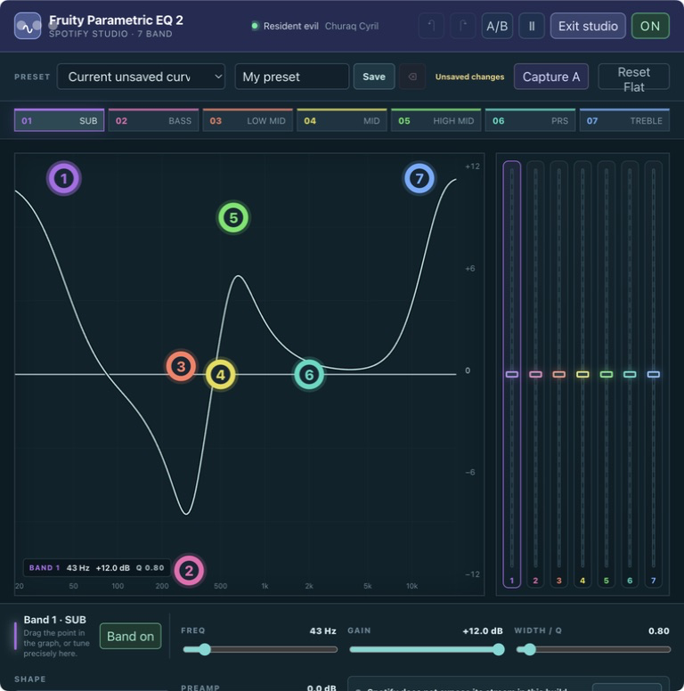

# Fruity EQ

> A seven-band parametric EQ studio for Spicetify, inspired by DAW workflows and designed for deliberate, local-first listening presets.



`macOS` · `Windows` · `Linux` · `Spotify Desktop` · `Spicetify Custom App`

Fruity EQ is unofficial desktop software. It runs inside Spicetify, which modifies the Spotify desktop client and can be affected by Spotify updates. It is not affiliated with Spotify or Image-Line.

## What it does

- Seven colour-coded parametric bands with a logarithmic 20 Hz–20 kHz graph.
- Direct node dragging for frequency and gain, plus precise FREQ, GAIN and WIDTH/Q controls.
- High-pass, low-shelf, peaking, notch, high-shelf, low-pass, band-pass and all-pass filter shapes.
- A response curve calculated with the browser's `BiquadFilterNode.getFrequencyResponse` model when available, matching the optional Web Audio filter path.
- Draggable right-side gain faders, per-band bypass, global bypass, preamp, A/B reference capture, Undo/Redo and keyboard shortcuts.
- Factory curves plus up to 40 named presets stored only in Spotify's local browser storage.
- A distraction-free Studio view built directly into Spotify: one visible app window and no popup.

## Real-time audio processing

Spotify desktop builds protect their playback stream from direct browser Web Audio access. Fruity EQ detects that boundary and never represents the graph alone as an audible effect.

On **macOS**, the included windowless local bridge is the real-time path: it routes Spotify through BlackHole 2ch, applies the same seven biquad filters in native CoreAudio processing, and sends the result to the chosen physical speakers. Press **Start real-time EQ** in Fruity EQ; Spotify remains the only visible application window. The in-app status and live signal meter are the source of truth.

The UI, local presets and response display run on macOS, Windows and Linux installations supported by Spicetify. The browser system-capture route remains an optional fallback where Spotify exposes the required capture and speaker APIs. Native real-time processing is currently packaged and tested for macOS; Windows and Linux must not be represented as real-time-supported until equivalent native bridges are shipped. See [System audio setup](docs/SYSTEM-AUDIO.md).

## Install

### One command from this repository

You need Spotify Desktop, [Spicetify](https://spicetify.app/) and Node.js 20 or newer.

```sh
git clone https://github.com/D1p1X/fruity-eq-spicetify.git
cd fruity-eq-spicetify
npm run install:local
```

The installer copies the Custom App into Spicetify's `CustomApps/fruity-eq` folder, preserves other configured custom apps, enables `fruity-eq`, and applies Spicetify.

### Manual installation

1. Copy `index.js`, `style.css` and `manifest.json` into `CustomApps/fruity-eq`.
2. Run:

```sh
spicetify config custom_apps fruity-eq
spicetify apply
```

3. Restart Spotify if its Custom Apps rail was already open, then choose **Fruity EQ**.

## Platform support

Fruity EQ is one **cross-platform Spicetify Custom App**. It uses Spotify Desktop's Chromium renderer and is intended for macOS, Windows and Linux installations supported by Spicetify. It never opens a second EQ window or popup. Its optional real-time native bridge is a local, windowless macOS helper.

Choose **Fruity EQ** from Spotify's Custom Apps rail to open the studio inside the existing Spotify window. Its local presets, graph, faders and A/B controls are the same on each supported desktop OS.

| Platform | Fruity EQ UI and presets | Real-time system route |
| --- | --- | --- |
| macOS | Supported | Supported: BlackHole 2ch + included local CoreAudio bridge |
| Windows | Supported | Browser-capture fallback only; no packaged native bridge yet |
| Linux | Supported | Browser-capture fallback only; no packaged native bridge yet |

## First minute

1. Drag a numbered point in the central graph: left/right changes frequency, up/down changes gain.
2. Select a band tab to make exact edits in the lower inspector.
3. Drag a narrow coloured fader on the right to set its band's gain directly.
4. Name a curve and press **Save**. It remains only on this device.
5. Use **Capture A**, then **A/B**, to compare the current curve with a temporary reference.
6. Use **Reset Flat** to return to the 7-band flat starting point.

## Development and verification

There are no runtime dependencies.

```sh
npm run check          # JS syntax, preview, Marketplace metadata and static safety checks
npm run test           # model behavior: curve math, storage repair, filter wiring and safe audio fallback
npm run build:release  # writes dist/fruity-eq
npm run install:local  # installs this Custom App locally and applies Spicetify
```

GitHub Actions runs the check and a clean release build on every push and pull request.

## Marketplace

This repository is ready for Spicetify Marketplace discovery: publish it publicly, add the `spicetify-apps` GitHub topic, and keep the root manifest, README and preview image tracked. Marketplace indexing is asynchronous. See the [publication checklist](docs/MARKETPLACE.md) and [full release walkthrough](docs/RELEASE.md).

## Privacy

Fruity EQ makes no network requests. EQ state and saved presets remain in Spotify's local browser storage. The project never uploads listening data, Spotify credentials or preset data.

## Credits

Created by [D1p1X](https://github.com/D1p1X). The release structure and Marketplace preparation follow the approach used by [Auraloom](https://github.com/D1p1X/auraloom-spicetify); Fruity EQ's interface, DSP model and controls are independently implemented.

## License

[MIT](LICENSE)
